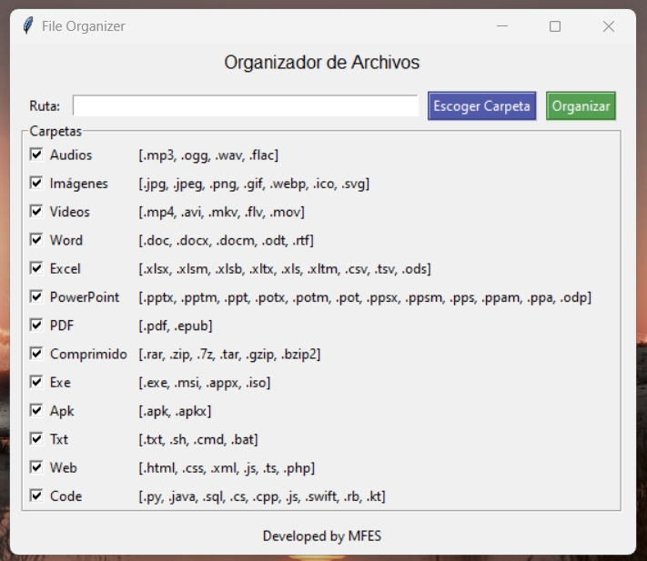

# File Organizer by MFES in Python
## Description
This program is designed to organize your files into folders based on the file extension.
The program first looks for and validates the path that is provided.
Then, collect all the folders with the boxes checked to create them.
Finally, the program moves the files to the corresponding folders according to the checked boxes.

## Use
Follow the steps to use the tool:
- Step 1: Open the executable file **FileOrganizer_ByMFES.exe**
- Step 2: Click on the **Select Folder** button and select the folder you want to organize.
- Step 3: Select the boxes of the folders you want to organize.
- Step 4: Click on the **Organize** button.

## Screenshots


## File Organizer Version
FileOrganizer `v1.0.0`

## Libraries
You need the **"os"** and **"tkinter"** libraries which are already integrated with python.
```python
import os
import tkinter
```

## Python Version
Made in `Python v3.11.2`
